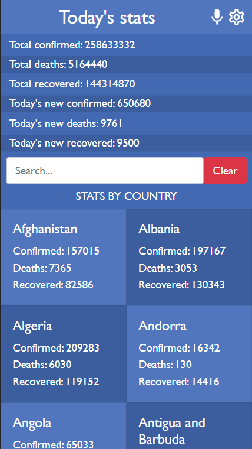
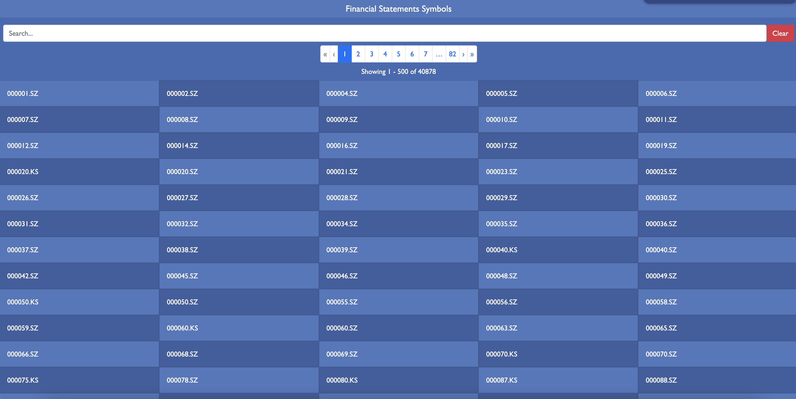

# Financial Modeling

This is a mobile web application that features 2 pages: The homepage and the details page. The homepage displays a list of symbols that have financial statements, and features a pagination bar that allows the user to limit the rendered results and a search bar that allows the user to filter by symbol. When the user clicks on any symbol, the website navigates to the details page, which contains the detailed Income Statement about that specific symbol. The data is consumed from [Financial Modeling Prep API](https://site.financialmodelingprep.com/developer/docs/). Built with React, Redux, and Bootstrap.

## Mobile

## Desktop

## Built With

- React
- Redux
- Bootstrap
- VSCode
- Git & GitHub

## Live Demo

[Live Demo Link](https://financial-modeling.dicodiaz.com.co/)

## Getting Started

To get this project up and running, follow these simple steps:

1. Clone the repository into your machine (Or download the .zip file and extract).
2. Open the project's folder.
3. Run `npm install`
4. Run `npm start`

### Setup

Follow the steps described before.

### Run tests

In order to run the predefined tests for this project, run `npm test`

## Author

👤 **Dico Diaz Dussan**

- GitHub: [@dicodiaz](https://github.com/dicodiaz)
- LinkedIn: [Dico Diaz Dussan](https://www.linkedin.com/in/dico-diaz-dussan/)
- Portfolio: [portfolio.dicodiaz.com.co](https://portfolio.dicodiaz.com.co)

## 🤝 Contributing

Contributions, issues, and feature requests are welcome!

Feel free to check the [issues page](../../issues/).

## Show your support

Give a ⭐️ if you like this project!

## Acknowledgments

- Original design idea by [Nelson Sakwa on Behance](https://www.behance.net/sakwadesignstudio).

## 📝 License

This project is [MIT](./MIT.md) licensed.
